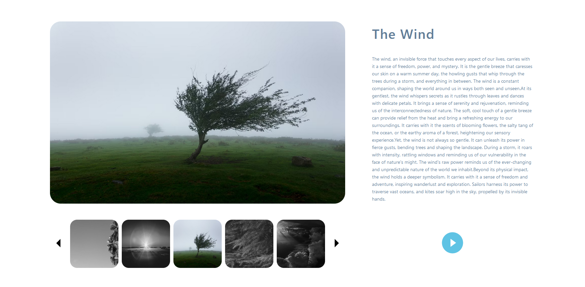

# Catalog Viewer

This is a catalog viewer React application that allows you to browse through a collection of images with details. The catalog viewer provides the following features:

- Display of images with their details
- Previous and Next buttons to navigate through the images
- Cycling functionality where clicking Next on the last image shows the first image, and clicking Previous on the first image shows the last image
- Play/Pause button to control automatic slideshow of images
- Clicking on any thumbnail displays the corresponding image with details
- Highlighting of the currently selected thumbnail with grayscale effect on others
- 
<div align="center">
  
</div>

## Live Demo

You can access the live demo of the Catalog Viewer application [here](https://catalog-viewer-react.netlify.app/).

## Installation

To use the Catalog Viewer component in your own project, follow these steps:

1. Clone this repository or download the source code.

2. Include the necessary files in your project directory.

3. Import the React component into your application:
```jsx
 import CatalogViewer from 'catalog-viewer';

  // Use the CatalogViewer component in your application
```

Note: Make sure you have the appropriate build setup (e.g., webpack, Babel) in your project to handle the import of the React component.

4.Customize the component as needed, providing your own data and styling.

## Usage

Once you have imported the CatalogViewer component into your application, you can use it as follows:
```jsx
import React from 'react';
import CatalogViewer from 'catalog-viewer';

function App() {
  // Your data and logic here

  return (
    <div>
      {/* Other components */}
      <CatalogViewer /* Pass necessary props */ />
    </div>
  );
}

export default App;

```

Remember to provide the necessary props to the CatalogViewer component based on your data and requirements.

## Contributing
Contributions to the Catalog Viewer project are welcome! If you find any bugs or have suggestions for improvements, please open an issue or submit a pull request.
